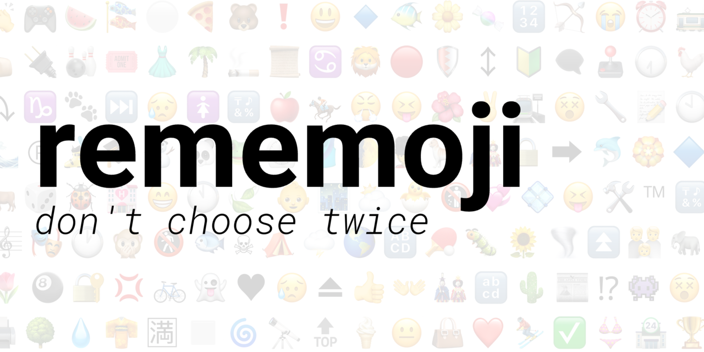

`rememoji` is a stylized rendition of The Odin Project's "Memory Card" project built on React with heavy usage of the framework's `useState` and `useEffect` hooks.

## How to Play

To win, one must select every emoji on the gameboard without ever selecting any of them more than once. Should the player fail to do so, the game generates a new set of emojis and restarts.

---

---

The number of emojis on the gameboard can be mutated at any given moment. Players can have as little as two or as many as thirty emojis displayed at once.

With that, do take note that any currently running round restarts if and when such a change is submitted.

## Installation

> Note: A live deployment of `rememoji` is [available](https://francislangit.github.io/rememoji/) online.

1. Clone the repository with `git clone https://github.com/FrancisLangit/rememoji` or download it as a `.zip` file.
2. Navigate to where the repository is saved on your local machine on a command line.
3. Enter `npm install` to install the application's dependencies.

## Setup

There are two ways to run the web application locally. One may run either of the following upon navigating to the repository on a command line.

### `npm start`

Such will run the app in development mode, allowing one to open up http://localhost:3000 to use the application.

### `npm run build`

This will alternatively create a locally constructed instance of the web application. If successful, one should find a `build/` folder generated within the repository.

## Contributing

Pull requests are welcome for those that would like to make a contribution. For those that would like to apply major changes to the repository, we'd like to request that you open up an issue first and discuss the changes you'd like to make.

## License

[MIT License](https://github.com/FrancisLangit/rememoji/blob/main/LICENSE)
